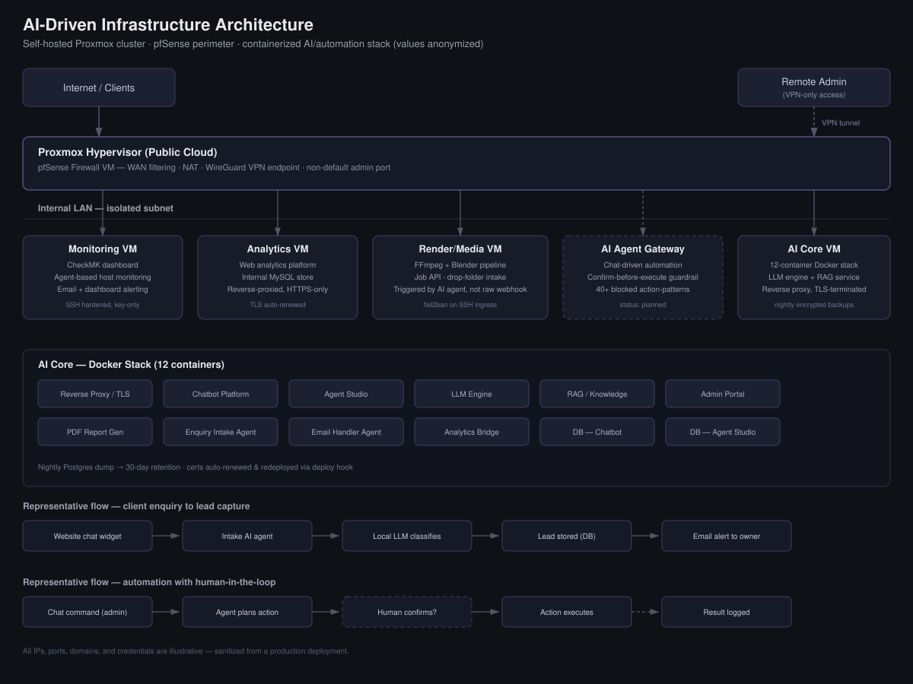

# Self-Hosted AI Infrastructure & Automation Platform

**A production system I designed and built** — a self-hosted virtualization platform running a containerized AI stack, media rendering pipeline, and chat-driven automation layer, secured behind a hardened perimeter firewall.

> Note: all IPs, domains, ports, and credentials shown below are anonymized/illustrative. This repo documents architecture and design decisions, not a working config.

## The Problem

The business needed one platform to handle three very different workloads — client-facing AI chat/lead capture, heavy media rendering for creative work, and low-friction remote operations — without renting separate managed services for each, and without giving up control over data or security posture.

## Architecture at a Glance

- **Hypervisor layer:** Proxmox VE cluster on a cloud-hosted bare-metal box, running 8 isolated VMs.
- **Perimeter:** pfSense firewall/router VM — inbound NAT rules restricted to only the ports each service needs, admin GUI moved off its default port, WireGuard VPN required for any administrative access.
- **AI core:** a single VM running a 12-container Docker stack — reverse proxy with automated TLS, a chatbot platform, an agent-orchestration layer, a locally-hosted LLM engine (with a cloud model as fallback for heavier reasoning), a RAG/knowledge service, and dedicated Postgres databases per app.
- **Media pipeline:** a dedicated render VM running FFmpeg and Blender behind a small job API, fed by a drop-folder pattern over SFTP rather than a public upload form.
- **Monitoring:** a CheckMK instance watching the other VMs, alerting by email and dashboard.
- **Analytics:** a self-hosted web analytics stack instead of a third-party tracker, reverse-proxied behind TLS.
- **Automation gateway (in progress):** a chat-driven agent that can plan multi-step actions (send an email, kick off a render job, follow up a lead) but requires an explicit human confirmation before anything executes — and has a growing list of hard-blocked action patterns it will never run unattended.

## Key Design Decisions

**Isolation over convenience.** Every function — firewall, AI, media, analytics, monitoring — lives on its own VM rather than one shared box, so a compromise or crash in one service doesn't cascade.

**Human-in-the-loop automation.** Rather than letting the automation agent act autonomously, every planned action surfaces to a human for a yes/no before it executes. This was a deliberate trade-off of speed for safety, given the agent has access to email sending and job triggering.

**Perimeter hardening, not obscurity alone.** Non-default admin ports and VPN-gated access reduce noise from opportunistic scanning, but the real controls are NAT rules scoped per-service and fail2ban on every SSH-exposed VM — obscurity is a bonus layer, not the strategy.

**Backups as a first-class citizen.** Nightly database dumps with a 30-day retention window, plus a separate firewall config export, both automated on a schedule rather than triggered manually.

**Certificate lifecycle automation.** TLS certificates renew automatically and a deploy hook copies the renewed cert into the reverse proxy and reloads it — no manual cert handling.

## Stack

`Proxmox VE` · `pfSense` · `Docker` · `Nginx` · `PostgreSQL` · `Ollama (local LLM)` · `FFmpeg` · `Blender` · `WireGuard` · `fail2ban` · `Let's Encrypt / certbot` · `CheckMK`

## What I'd Improve Next

- Finish the automation gateway's rollout and formalize its blocked-action list as a policy file rather than inline logic.
- Move from manual monitoring agent rollout to a config-managed deployment across all VMs.
- Add centralized log aggregation across the stack rather than per-VM log review.

---
